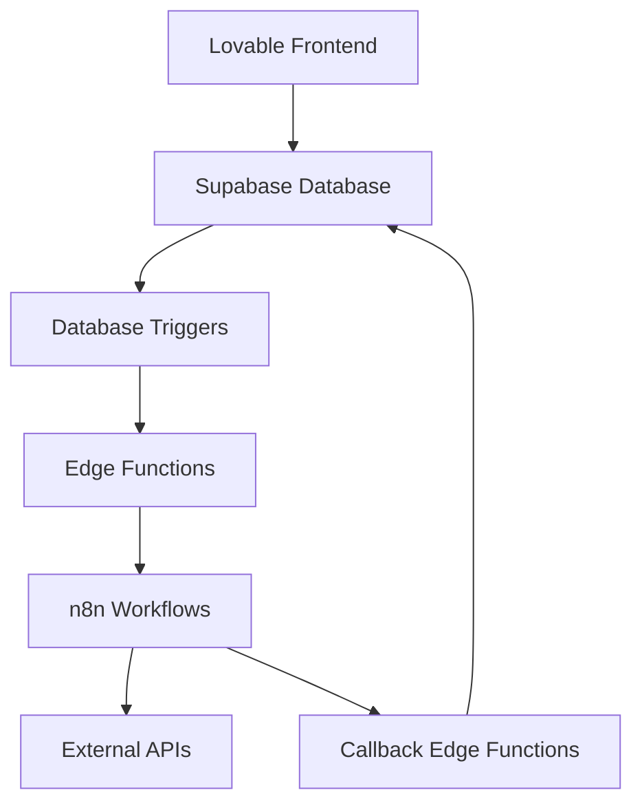

# ⚡ Edge Functions Supabase

## Vue d'ensemble

Les Edge Functions Supabase servent d'intermédiaire entre l'interface Lovable et les workflows n8n, permettant une architecture découplée et sécurisée.

### 🏗️ Architecture des Edge Functions


## Fonctions Déployées

### 1. webhook-dispatcher
**Rôle**: Dispatch automatique des webhooks vers n8n
**Triggers**: Appelée par les triggers PostgreSQL
**Endpoint**: `/functions/v1/webhook-dispatcher`

```typescript
// Utilisation depuis un trigger PostgreSQL
PERFORM net.http_post(
  url := 'https://jwulacyvagxztjopbflh.supabase.co/functions/v1/webhook-dispatcher',
  headers := '{"Content-Type": "application/json"}'::jsonb,
  body := jsonb_build_object(
    'webhook_name', 'conversation-update',
    'event_type', 'message_created',
    'payload', payload_data
  )
);
```

**Fonctionnalités**:
- Récupération automatique de la configuration webhook
- Retry automatique en cas d'échec
- Logging complet des appels
- Support de multiples endpoints n8n

### 2. n8n-api-caller
**Rôle**: Appels directs aux workflows n8n depuis le frontend
**Endpoint**: `/functions/v1/n8n-api-caller`

```typescript
// Utilisation depuis le frontend
const response = await supabase.functions.invoke('n8n-api-caller', {
  body: {
    workflow_name: 'conversation-processor',
    execution_data: {
      conversation_id: 'uuid',
      message_content: 'Hello',
      sender_type: 'guest'
    }
  }
});
```

**Workflows Supportés**:
- `conversation-processor` - Traitement des messages
- `document-analyzer` - Analyse de documents
- `escalation-handler` - Gestion des escalations
- `metrics-collector` - Collecte de métriques
- `notification-sender` - Envoi de notifications

### 3. document-processor
**Rôle**: Traitement des documents uploadés
**Triggers**: Upload de fichiers dans le storage
**Endpoint**: `/functions/v1/document-processor`

```typescript
// Traitement automatique après upload
{
  "attachment_id": "uuid",
  "file_type": "application/pdf",
  "processing_type": "pdf_extraction",
  "priority": 3
}
```

**Types de Traitement**:
- `image_analysis` - Analyse d'images (OCR, détection)
- `pdf_extraction` - Extraction de texte PDF
- `general_processing` - Traitement générique

### 4. incident-monitor
**Rôle**: Monitoring et alertes des incidents système
**Triggers**: Insertions dans `system_incidents`
**Endpoint**: `/functions/v1/incident-monitor`

```typescript
// Déclenchement automatique sur incident
{
  "incident_id": "uuid",
  "incident_type": "database_error",
  "severity": "high",
  "source_component": "conversation_service"
}
```

**Niveaux de Sévérité**:
- `critical` - Alerte immédiate
- `high` - Notification rapide
- `medium` - Monitoring standard
- `low` - Log seulement

### 5. metrics-aggregator
**Rôle**: Agrégation et analyse des métriques
**Schedule**: Cron toutes les 15 minutes
**Endpoint**: `/functions/v1/metrics-aggregator`

```sql
-- Configuration du cron job
SELECT cron.schedule(
  'metrics-aggregation',
  '*/15 * * * *',
  $$
  SELECT net.http_post(
    url := 'https://jwulacyvagxztjopbflh.supabase.co/functions/v1/metrics-aggregator',
    headers := '{"Content-Type": "application/json", "Authorization": "Bearer ANON_KEY"}'::jsonb,
    body := '{"action": "aggregate"}'::jsonb
  );
  $$
);
```

## Configuration et Déploiement

### Variables d'Environnement
```bash
# Secrets Supabase configurés
SUPABASE_URL=https://jwulacyvagxztjopbflh.supabase.co
SUPABASE_ANON_KEY=eyJhbGciOiJIUzI1NiIsInR5cCI6IkpXVCJ9...
SUPABASE_SERVICE_ROLE_KEY=eyJhbGciOiJIUzI1NiIsInR5cCI6IkpXVCJ9...
N8N_API_TOKEN=your_n8n_token_here
OPENAI_API_KEY=your_openai_key_here
```

### Structure des Fichiers
```
supabase/functions/
├── webhook-dispatcher/
│   └── index.ts
├── n8n-api-caller/
│   └── index.ts
├── document-processor/
│   └── index.ts
├── incident-monitor/
│   └── index.ts
└── metrics-aggregator/
    └── index.ts
```

### Déploiement Automatique
Les Edge Functions sont déployées automatiquement via Lovable lors des modifications. Aucune action manuelle n'est requise.

## Gestion des Erreurs et Monitoring

### Logging Standardisé
```typescript
// Pattern de logging dans toutes les fonctions
console.log(`[${functionName}] ${action}:`, {
  timestamp: new Date().toISOString(),
  payload: request_data,
  result: response_data
});

console.error(`[${functionName}] Error:`, {
  error: error.message,
  stack: error.stack,
  context: request_context
});
```

### Métriques de Performance
```sql
-- Suivi des performances des Edge Functions
CREATE VIEW edge_function_metrics AS
SELECT 
  function_name,
  AVG(execution_time_ms) as avg_execution_time,
  COUNT(*) as total_calls,
  COUNT(*) FILTER (WHERE status = 'success') as successful_calls,
  COUNT(*) FILTER (WHERE status = 'error') as failed_calls,
  MAX(created_at) as last_call
FROM function_execution_logs
WHERE created_at > NOW() - INTERVAL '24 hours'
GROUP BY function_name;
```

### Alertes et Notifications
- **Échecs de webhook**: Alerte après 3 tentatives
- **Timeout**: Alerte si > 30 secondes
- **Erreurs système**: Notification immédiate pour erreurs critiques
- **Volume**: Alerte si > 1000 appels/heure

## Intégration avec n8n

### Endpoints n8n Configurés
```typescript
const N8N_ENDPOINTS = {
  base_url: 'https://n8n.samy360.com',
  webhooks: {
    'conversation-process': '/webhook/conversation-process',
    'document-analyze': '/webhook/document-analyze',
    'escalation-handle': '/webhook/escalation-handle',
    'metrics-collect': '/webhook/metrics-collect',
    'notification-send': '/webhook/notification-send',
    'incident-alert': '/webhook/incident-alert'
  }
};
```

### Authentification
- **Headers requis**: `Authorization: Bearer N8N_API_TOKEN`
- **Content-Type**: `application/json`
- **Timeout**: 30 secondes par défaut
- **Retry**: 3 tentatives avec backoff exponentiel

### Format des Payloads
```typescript
// Format standardisé pour n8n
interface N8nPayload {
  event_type: string;
  timestamp: string;
  source: 'supabase_edge_function';
  payload: {
    // Données spécifiques à l'événement
  };
  metadata: {
    user_id?: string;
    session_id?: string;
    conversation_id?: string;
  };
}
```

## Sécurité

### CORS et Headers
```typescript
const corsHeaders = {
  'Access-Control-Allow-Origin': '*',
  'Access-Control-Allow-Headers': 'authorization, x-client-info, apikey, content-type',
  'Access-Control-Allow-Methods': 'POST, OPTIONS'
};
```

### Validation des Requêtes
```typescript
// Validation des payloads
const validatePayload = (payload: any, schema: any) => {
  // Validation avec Zod ou équivalent
  return schema.parse(payload);
};

// Rate limiting
const checkRateLimit = async (user_id: string) => {
  // Vérification des limites par utilisateur
};
```

### Audit Trail
- Toutes les exécutions sont loggées
- Payloads sensibles sont masqués
- Traçabilité complète des appels
- Rétention des logs : 30 jours

## Développement et Debug

### Tests Locaux
```bash
# Installation Supabase CLI
npm install -g supabase

# Démarrage local
supabase start
supabase functions serve

# Test d'une fonction
curl -X POST http://localhost:54321/functions/v1/webhook-dispatcher \
  -H "Content-Type: application/json" \
  -d '{"webhook_name": "test", "event_type": "test", "payload": {}}'
```

### Logs en Temps Réel
```bash
# Suivi des logs en production
supabase functions logs webhook-dispatcher --follow
```

### Debug Interface
- **Supabase Dashboard**: Logs et métriques
- **n8n Interface**: Exécution des workflows
- **Monitoring Custom**: Dashboard dans l'app

---

*Documentation des Edge Functions mise à jour pour l'architecture Lovable → Supabase → n8n*