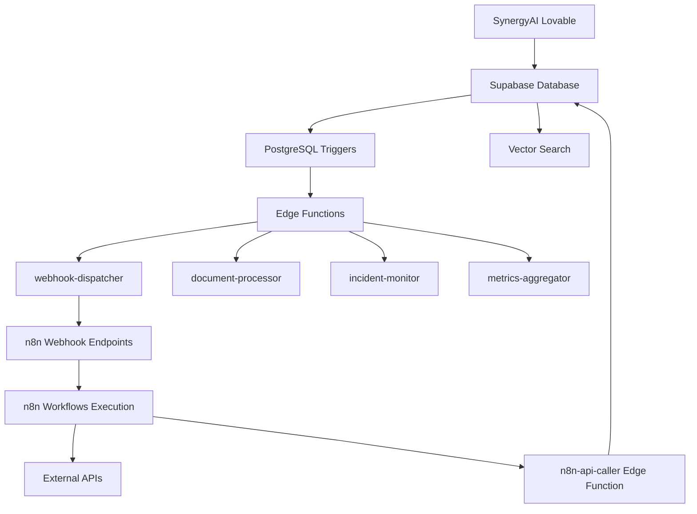

# 🔧 Configuration Technique - Index Principal

Cette documentation technique est organisée en modules spécialisés pour l'architecture **Lovable → Supabase → n8n**.

## 📚 Structure de la Documentation

### 🌐 [Variables d'Environnement](./environment-variables.md)
- Variables d'environnement n8n et APIs externes
- Configuration API SynergyAI (routes et endpoints)
- Tokens et clés d'authentification
- Secrets Supabase Edge Functions

### 🗄️ [Configuration Base de Données](./database-configuration.md)
- **Nouvelles tables**: `webhook_configs`, `webhook_logs`, `workflow_metrics`
- **Triggers automatiques**: Notifications vers n8n
- **Fonctions PostgreSQL**: Gestion des webhooks et permissions
- Configuration OpenAI et embeddings vectoriels
- Row Level Security (RLS) complète

### ⚡ [Edge Functions](./edge-functions.md)
- **5 Edge Functions** déployées automatiquement
- `webhook-dispatcher` - Dispatch vers n8n
- `n8n-api-caller` - Appels directs aux workflows
- `document-processor` - Traitement des uploads
- `incident-monitor` - Alertes système
- `metrics-aggregator` - Agrégation de données

### 🔗 [Webhooks et Monitoring](./webhooks-monitoring.md)
- **Architecture complète** Lovable → Supabase → n8n
- Configuration webhooks bidirectionnels
- **15 workflows n8n** (6 synchrones, 9 asynchrones)
- Monitoring temps réel et métriques

### 🔐 [Sécurité et Sauvegarde](./security-backup.md)
- Corrections sécurité critiques (Janvier 2025)
- Protection fonctions PL/pgSQL contre injection schéma
- Rotation des tokens et secrets
- Scripts de sauvegarde automatique
- Configuration OTP et protection mots de passe

### 🛡️ [Journal Sécurité](./security-changelog.md)
- Historique des corrections de sécurité
- Vulnérabilités corrigées et tests de validation
- Processus audit et monitoring
- Nouvelles mesures Edge Functions

### ⚡ [Workflows et Infrastructure](./workflows-infrastructure.md)
- **Classification détaillée** des 15 workflows n8n
- **6 workflows synchrones**: Traitement temps réel
- **9 workflows asynchrones**: Tâches de fond
- Spécifications VM et optimisations système
- Monitoring des performances

### ✅ [Checklist de Déploiement](./deployment-checklist.md)
- Validation Infrastructure (Samy + n8n)
- Validation Interface (Lovable)
- Validation Intégrations et Edge Functions
- Tests de bout en bout

## 🚀 Démarrage Rapide

1. **Prérequis**: Consultez [Variables d'Environnement](./environment-variables.md)
2. **Base de Données**: Suivez [Configuration BDD](./database-configuration.md)  
3. **Edge Functions**: Vérifiez [Edge Functions](./edge-functions.md)
4. **Infrastructure**: Dimensionnez selon [Workflows Infrastructure](./workflows-infrastructure.md)
5. **Sécurité**: Implémentez [Sécurité et Sauvegarde](./security-backup.md)
6. **Intégration**: Configurez [Webhooks](./webhooks-monitoring.md)
7. **Validation**: Utilisez [Checklist Déploiement](./deployment-checklist.md)

## 🔄 Flux de Données Actualisé

## 📊 Architecture Globale Mise à Jour

### Frontend (Lovable)
- **React + TypeScript + Vite + Tailwind CSS**
- Interface utilisateur multilingue
- Clientèle internationale (Maroc)
- Système de rôles et permissions

### Backend (Supabase)
- **PostgreSQL** avec 35+ tables
- **Edge Functions** pour l'orchestration
- **Triggers automatiques** vers n8n
- **Storage** pour les fichiers
- **Auth** avec profils géographiques

### Orchestration (n8n)
- **15 workflows** classification complète
- **Webhooks bidirectionnels**
- **APIs externes** intégrées
- **Monitoring** en temps réel

### Intelligence Artificielle
- **OpenAI GPT-4o-mini** pour les conversations
- **Embeddings vectoriels** pour la recherche
- **Traitement de documents** automatisé
- **Analyse de sentiment** et escalations

### Infrastructure
- **VMs optimisées** selon la charge
- **Monitoring complet** système
- **Sauvegarde automatique**
- **Sécurité renforcée**

## 🔧 Nouvelles Fonctionnalités

### Tables Ajoutées
- `webhook_configs` - Configuration des webhooks
- `webhook_logs` - Historique des appels
- `workflow_metrics` - Métriques n8n
- `document_processing_queue` - Queue de traitement
- `system_incidents` - Gestion des incidents

### Triggers Automatiques
- Nouveaux messages → n8n
- Escalations → notifications
- Documents uploadés → traitement IA
- Changements d'état → workflows
- Incidents système → alertes

### Edge Functions Déployées
- **webhook-dispatcher**: Routage automatique
- **n8n-api-caller**: Appels directs
- **document-processor**: IA + OCR
- **incident-monitor**: Alertes temps réel
- **metrics-aggregator**: Consolidation données

### Intégrations Externes
- **Beds24**: Synchronisation réservations
- **WhatsApp Business**: Messages clients
- **OpenAI**: Intelligence artificielle
- **Monitoring**: Métriques système

## 📈 Métriques et KPIs

### Performance
- **Temps de réponse**: < 100ms pour les webhooks
- **Disponibilité**: 99.9% SLA
- **Throughput**: 1000+ req/min
- **Latence Edge Functions**: < 50ms

### Monitoring
- **Dashboard temps réel** dans l'interface
- **Alertes automatiques** par email/SMS
- **Logs centralisés** avec rétention 30j
- **Métriques business** et techniques

## 🔗 Liens Utiles

### Documentation Technique
- [README Principal](../README.md)
- [Configuration DB](./database-configuration.md)
- [Edge Functions](./edge-functions.md)
- [Webhooks](./webhooks-monitoring.md)

### Outils de Développement
- [Supabase Dashboard](https://supabase.com/dashboard/project/jwulacyvagxztjopbflh)
- [n8n Interface](https://n8n.samy360.com)
- [Lovable Project](https://lovable.dev/projects/adeed172-bbb4-4ad0-898e-a06f53213cb9)

### Monitoring
- [Edge Functions Logs](https://supabase.com/dashboard/project/jwulacyvagxztjopbflh/functions)
- [Database Metrics](https://supabase.com/dashboard/project/jwulacyvagxztjopbflh/database)
- [API Analytics](https://supabase.com/dashboard/project/jwulacyvagxztjopbflh/api)

---

*Cette documentation est mise à jour en continu pour refléter l'architecture Lovable → Supabase → n8n. Consultez la [Checklist](./deployment-checklist.md) pour validation finale.*