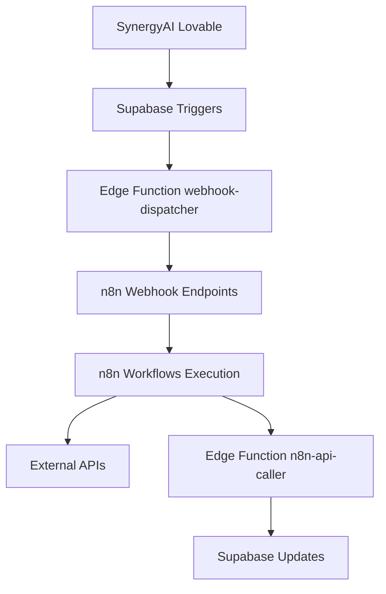

# 🔗 Configuration Webhooks et Monitoring

## Architecture des Webhooks

### Flux Lovable → Supabase → n8n


## Configuration des Edge Functions

### 1. Webhook Dispatcher
```typescript
// supabase/functions/webhook-dispatcher/index.ts
import { serve } from "https://deno.land/std@0.168.0/http/server.ts";

const corsHeaders = {
  'Access-Control-Allow-Origin': '*',
  'Access-Control-Allow-Headers': 'authorization, x-client-info, apikey, content-type',
};

interface WebhookPayload {
  webhook_name: string;
  event_type: string;
  payload: any;
}

serve(async (req) => {
  if (req.method === 'OPTIONS') {
    return new Response(null, { headers: corsHeaders });
  }

  try {
    const { webhook_name, event_type, payload }: WebhookPayload = await req.json();
    
    // Récupérer la configuration webhook
    const { data: config } = await supabase
      .from('webhook_configs')
      .select('*')
      .eq('name', webhook_name)
      .eq('is_active', true)
      .single();

    if (!config) {
      throw new Error(`Webhook config not found: ${webhook_name}`);
    }

    // Envoyer vers n8n
    const response = await fetch(config.endpoint_url, {
      method: 'POST',
      headers: {
        'Content-Type': 'application/json',
        'Authorization': `Bearer ${config.secret_token}`,
      },
      body: JSON.stringify({
        event_type,
        payload,
        timestamp: new Date().toISOString()
      })
    });

    // Logger le résultat
    await supabase.from('webhook_logs').insert({
      webhook_config_id: config.id,
      event_type,
      payload,
      response_status: response.status,
      response_body: await response.text(),
      attempt_number: 1,
      processing_time_ms: Date.now() - startTime
    });

    return new Response(JSON.stringify({ success: true }), {
      headers: { ...corsHeaders, 'Content-Type': 'application/json' }
    });
  } catch (error) {
    console.error('Webhook dispatch error:', error);
    return new Response(JSON.stringify({ error: error.message }), {
      status: 500,
      headers: { ...corsHeaders, 'Content-Type': 'application/json' }
    });
  }
});
```

### 2. n8n API Caller
```typescript
// supabase/functions/n8n-api-caller/index.ts
interface N8nApiRequest {
  workflow_name: string;
  execution_data: any;
  webhook_name?: string;
}

const callN8nWorkflow = async (workflowName: string, data: any) => {
  const workflowEndpoints = {
    'conversation-processor': 'https://n8n.samy360.com/webhook/conversation-process',
    'document-analyzer': 'https://n8n.samy360.com/webhook/document-analyze',
    'escalation-handler': 'https://n8n.samy360.com/webhook/escalation-handle',
    'metrics-collector': 'https://n8n.samy360.com/webhook/metrics-collect',
    'notification-sender': 'https://n8n.samy360.com/webhook/notification-send'
  };

  const endpoint = workflowEndpoints[workflowName];
  if (!endpoint) {
    throw new Error(`Unknown workflow: ${workflowName}`);
  }

  const response = await fetch(endpoint, {
    method: 'POST',
    headers: {
      'Content-Type': 'application/json',
      'Authorization': `Bearer ${Deno.env.get('N8N_API_TOKEN')}`
    },
    body: JSON.stringify(data)
  });

  return {
    success: response.ok,
    status: response.status,
    data: await response.json()
  };
};
```

## Configuration n8n

### Webhooks Entrants (depuis Supabase)
```javascript
// Configuration webhook n8n pour recevoir de Supabase
{
  "nodes": [
    {
      "name": "Webhook Trigger",
      "type": "n8n-nodes-base.webhook",
      "parameters": {
        "httpMethod": "POST",
        "path": "conversation-process",
        "authentication": "headerAuth",
        "headerAuth": {
          "name": "Authorization",
          "value": "={{ $env.SUPABASE_WEBHOOK_TOKEN }}"
        }
      }
    }
  ]
}
```

### Webhooks Sortants (vers Supabase)
```javascript
// Configuration pour appeler les Edge Functions Supabase
{
  "name": "Call Supabase Function",
  "type": "n8n-nodes-base.httpRequest",
  "parameters": {
    "url": "https://jwulacyvagxztjopbflh.supabase.co/functions/v1/n8n-api-caller",
    "method": "POST",
    "headers": {
      "Authorization": "Bearer {{ $env.SUPABASE_ANON_KEY }}",
      "Content-Type": "application/json"
    },
    "body": {
      "workflow_name": "{{ $workflow.name }}",
      "execution_id": "{{ $execution.id }}",
      "status": "{{ $execution.status }}",
      "data": "{{ $json }}"
    }
  }
}
```

## Configuration des Triggers Supabase

### Triggers Principaux
```sql
-- Trigger pour nouveaux messages
CREATE TRIGGER conversation_message_webhook
  AFTER INSERT ON conversation_messages
  FOR EACH ROW EXECUTE FUNCTION notify_conversation_update();

-- Trigger pour escalations
CREATE TRIGGER escalation_webhook
  AFTER INSERT ON escalation_history
  FOR EACH ROW EXECUTE FUNCTION notify_escalation_event();

-- Trigger pour changements d'état de conversation
CREATE TRIGGER conversation_state_webhook
  AFTER UPDATE ON conversations
  FOR EACH ROW EXECUTE FUNCTION notify_conversation_state_change();

-- Trigger pour changements de paramètres
CREATE TRIGGER settings_webhook
  AFTER UPDATE ON system_settings
  FOR EACH ROW EXECUTE FUNCTION notify_settings_change();

-- Trigger pour documents uploadés
CREATE TRIGGER document_upload_webhook
  AFTER INSERT ON chat_attachments
  FOR EACH ROW EXECUTE FUNCTION notify_document_upload();
```

### Fonctions de Notification
```sql
-- Notification pour mise à jour conversation
CREATE OR REPLACE FUNCTION notify_conversation_update()
RETURNS TRIGGER AS $$
BEGIN
  PERFORM public.trigger_webhook_notification(
    'conversation-update',
    'message_created',
    jsonb_build_object(
      'message_id', NEW.id,
      'conversation_id', NEW.conversation_id,
      'sender_type', NEW.sender_type,
      'message_content', NEW.message_content,
      'created_at', NEW.created_at
    )
  );
  RETURN NEW;
END;
$$ LANGUAGE plpgsql;

-- Notification pour escalations
CREATE OR REPLACE FUNCTION notify_escalation_event()
RETURNS TRIGGER AS $$
BEGIN
  PERFORM public.trigger_webhook_notification(
    'escalation-trigger',
    'escalation_created',
    jsonb_build_object(
      'escalation_id', NEW.id,
      'conversation_id', NEW.conversation_id,
      'from_role', NEW.from_role,
      'to_role', NEW.to_role,
      'escalation_reason', NEW.escalation_reason,
      'created_at', NEW.created_at
    )
  );
  RETURN NEW;
END;
$$ LANGUAGE plpgsql;
```

## Workflows n8n Configurés

### 1. Workflows Synchrones (6)
- **conversation-processor**: Traitement immédiat des messages
- **escalation-handler**: Gestion des escalations
- **document-analyzer**: Analyse de documents uploadés
- **user-authenticator**: Vérification des utilisateurs
- **notification-sender**: Envoi de notifications
- **metrics-realtime**: Métriques en temps réel

### 2. Workflows Asynchrones (9)
- **daily-reports**: Rapports quotidiens
- **data-cleanup**: Nettoyage des données
- **backup-manager**: Gestion des sauvegardes
- **integration-sync**: Synchronisation intégrations
- **ai-training**: Entraînement des modèles IA
- **performance-analyzer**: Analyse de performance
- **guest-follow-up**: Suivi client automatique
- **property-updates**: Mise à jour des propriétés
- **team-scheduling**: Planification d'équipe

## Configuration Monitoring

### Métriques n8n
```yaml
# Variables d'environnement n8n
N8N_METRICS=true
N8N_METRICS_PREFIX=synergyai_
N8N_LOG_LEVEL=info
N8N_LOG_OUTPUT=file,console
N8N_LOG_FILE_LOCATION=/var/log/n8n/n8n.log
N8N_WEBHOOK_URL=https://n8n.samy360.com
```

### Dashboard de Monitoring
```sql
-- Vue pour dashboard de monitoring
CREATE VIEW monitoring_dashboard AS
SELECT 
  wm.workflow_name,
  COUNT(*) as total_executions,
  AVG(wm.duration_ms) as avg_duration,
  COUNT(*) FILTER (WHERE wm.status = 'completed') as successful,
  COUNT(*) FILTER (WHERE wm.status = 'failed') as failed,
  MAX(wm.created_at) as last_execution
FROM workflow_metrics wm
WHERE wm.created_at > NOW() - INTERVAL '24 hours'
GROUP BY wm.workflow_name;

-- Métriques des webhooks
CREATE VIEW webhook_health AS
SELECT 
  wc.name,
  wc.endpoint_url,
  wc.is_active,
  COUNT(wl.id) as total_calls,
  AVG(wl.processing_time_ms) as avg_response_time,
  COUNT(*) FILTER (WHERE wl.response_status = 200) as successful_calls,
  MAX(wl.created_at) as last_call
FROM webhook_configs wc
LEFT JOIN webhook_logs wl ON wc.id = wl.webhook_config_id
WHERE wl.created_at > NOW() - INTERVAL '24 hours' OR wl.created_at IS NULL
GROUP BY wc.id, wc.name, wc.endpoint_url, wc.is_active;
```

## Configuration des Intégrations

### APIs Externes Connectées
```typescript
// Configuration des intégrations dans system_settings
const integrationConfigs = {
  "beds24": {
    "api_url": "https://api.beds24.com/v2",
    "webhook_endpoint": "https://n8n.samy360.com/webhook/beds24",
    "sync_frequency": "hourly"
  },
  "whatsapp_business": {
    "api_url": "https://graph.facebook.com/v18.0",
    "webhook_endpoint": "https://n8n.samy360.com/webhook/whatsapp",
    "verify_token": "WEBHOOK_VERIFY_TOKEN"
  },
  "openai": {
    "api_url": "https://api.openai.com/v1",
    "model": "gpt-4o-mini",
    "embedding_model": "text-embedding-3-small"
  }
};
```

### Webhook de Test
```bash
# Test webhook vers n8n
curl -X POST https://n8n.samy360.com/webhook/test \
  -H "Content-Type: application/json" \
  -H "Authorization: Bearer YOUR_TOKEN" \
  -d '{
    "event_type": "test",
    "payload": {
      "message": "Test depuis Supabase",
      "timestamp": "2025-01-19T10:00:00Z"
    }
  }'
```

## Sécurité et Authentification

### Tokens et Secrets
- **SUPABASE_ANON_KEY**: Clé publique Supabase
- **SUPABASE_SERVICE_ROLE_KEY**: Clé service pour Edge Functions
- **N8N_API_TOKEN**: Token d'authentification n8n
- **WEBHOOK_SECRET_TOKENS**: Tokens secrets pour chaque webhook

### Validation des Webhooks
```typescript
// Validation des signatures webhook
const validateWebhookSignature = (payload: string, signature: string, secret: string) => {
  const expectedSignature = crypto
    .createHmac('sha256', secret)
    .update(payload)
    .digest('hex');
  
  return crypto.timingSafeEqual(
    Buffer.from(signature, 'hex'),
    Buffer.from(expectedSignature, 'hex')
  );
};
```

---

*Configuration mise à jour pour l'architecture complète Lovable → Supabase → n8n*